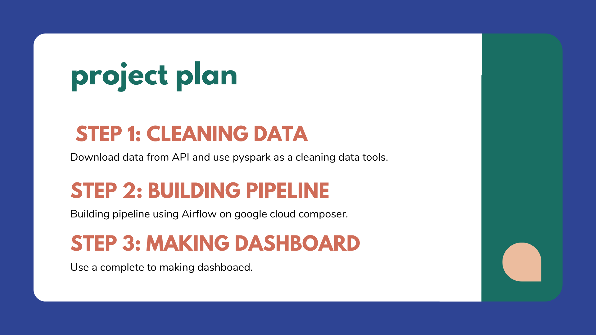
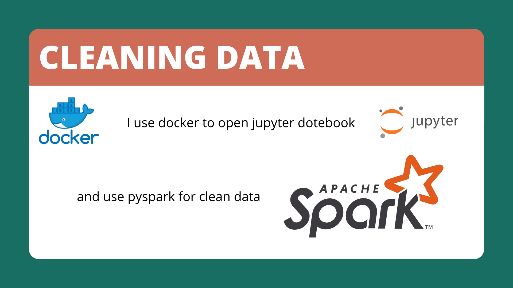
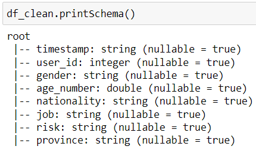
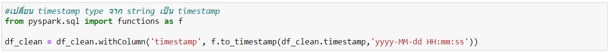
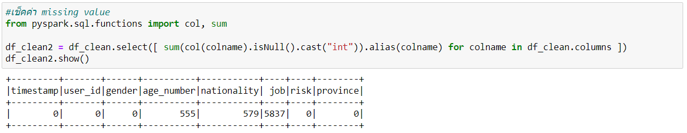
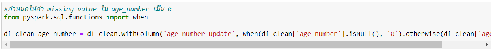
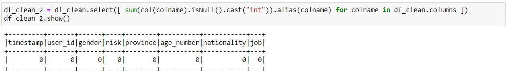
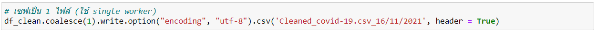

## Welcome to my data engineer project
I am making a project using knowledge that I learn from road to data engineer 2.0 courses. The concept of my project is loaded covid-19 Thailand found a case by API, then cleaning the data and making pipeline to load data to data warehouse then making dashboard.

### STEP1: CLEANING DATA

#### In this step you can look at my code "[covid-19.ipynb](covid-19.ipynb)"
I use jupyter notebook for a tool. First, I run jupyter notebook by docker. Then I install pyspark for a tool to clean data. Next i download covid-19 data from API, after I got a data I select only column that I need and change schema timestamp columns from string to timestamp.

Then, finding a missing value

and fixing all missing values, for an example, the age_number column change Null to 0

after fixing all missing, save the file

